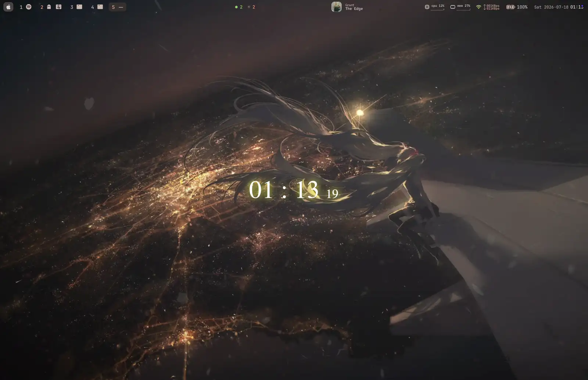
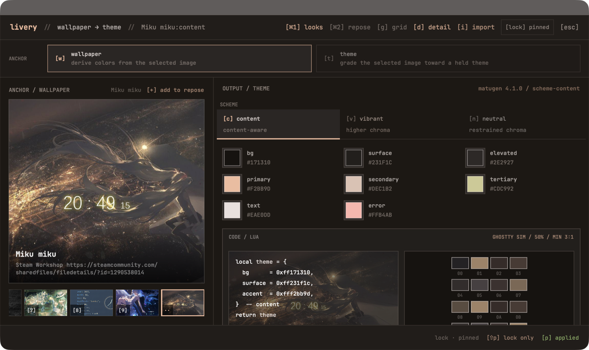
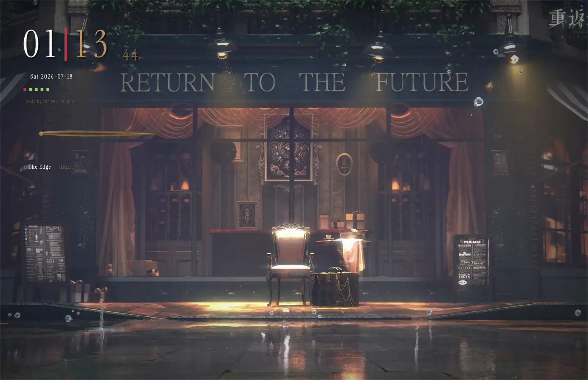

# vestiary

Vestiary coordinates wallpapers, application colors, and desktop status
surfaces on macOS. A Look pairs a semantic application theme with a wallpaper.
Livery applies it transactionally to the desktop layer and whichever supported
applications are present. Fresco plays video and web wallpapers. Herald carries
task state to bars, quiet screens, and Tabard notifications.

The integrations are optional. Consumers retain their own defaults when the
theme contract is absent. Livery and Fresco run without Herald publishers.



One `livery apply` rethemes enabled applications, renders a portable CSS
artifact, and changes the wallpaper layer. The `lvry` panel previews
wallpaper-derived and independently authored themes before applying them.



The quiet-screen cover composes over the live wallpaper.



## Components

Each component has a bounded dependency on the others.

- **livery** (with `contract/`, `adapters/`, `integrations/`, and
  `livery.nvim/`) is the theming engine. It derives a theme from a wallpaper or
  holds a semantic theme fixed while grading a wallpaper toward it. Fresco
  integration is optional.
- **fresco** renders images, Wallpaper Engine video/web projects, and bare
  video files at the macOS desktop layer. The Livery bridge activates when a
  manifest exists.
- **fresco-scene** is the separately licensed GPL helper for Wallpaper Engine
  scene packages. Fresco supervises its bounded image, particle, effect,
  custom-shader, text, text-script, audio-responsive image, and narrow
  audio-driven float renderer. Sound playback, media, puppet animation, other
  dynamic SceneScript, advanced particle variants, and 3D remain outside the
  proven subset.
- **repose** is the quiet-screen composition. Fresco hosts it over the current
  live wallpaper.
- **herald** is the state bus. It defines per-channel JSON snapshots and ships
  a doorbell helper; publishers live in user hooks and configuration.
- **tabard** is the on-screen display. It turns Herald task transitions and
  Livery Look changes into themed desktop notifications.

## Requirements

The base install requires macOS, `jq`, and the Xcode Command Line Tools.
`~/.local/bin` must be on `PATH`. A minimum supported macOS release has not yet
been established.

The application integrations are optional. Vestiary does not install or
configure their host applications.

| Feature | Additional requirement |
|---|---|
| Application theming | Any combination of Ghostty, tmux, Neovim, SketchyBar, JankyBorders, and Visual Studio Code. |
| Portable theme artifact | Any CSS consumer; Livery emits custom properties without an additional host application. |
| JankyBorders loader | A yabai configuration file; the generated border command is sourced from `yabairc`. |
| Live video and web wallpapers | None. Fresco uses native macOS frameworks and includes a sample. |
| Audio-reactive wallpapers | `cava` plus Screen & System Audio Recording permission. |
| Now-playing data | `media-control`. |
| Workshop downloads | Wallpaper Engine ownership on Steam and `steamcmd`. |
| Wallpaper Engine scene proof | A user-owned official asset directory, plus CMake, Git, pkg-config, LZ4, and FreeType to build the GPL helper. |
| Video frame extraction and scene lock images | `ffmpeg`. |
| Wallpaper imports | Matugen 4.1.0; the installer downloads it on Apple silicon or builds it with Cargo elsewhere. |

Missing applications are skipped. A detected supported application must have
its Vestiary loader wired before a generated Look can be applied. The installer
can add loaders for the recognized default configuration layouts. Adapters can
be enabled or disabled in `~/.config/vestiary/targets.json`; `livery targets`
shows the resolved set.

If `yabai` is installed, its display and Space queries must be available during
Look application. Vestiary falls back to native display discovery when `yabai`
is absent.

## Permissions

Static Looks and ordinary Fresco playback require no macOS privacy grant.
Audio-reactive wallpapers require Screen & System Audio Recording so `cava`
can read system output levels. Fresco does not open the permission prompt from
its background process. Run `fresco audio-permission`, grant the displayed
Fresco application in System Settings, and restart Fresco.

Vestiary does not manage permissions required by host applications. Complete
yabai, JankyBorders, and other application-specific setup before enabling their
adapters.

## Install

```sh
git clone https://github.com/Astral1119/vestiary.git
cd vestiary
./install
```

`./install` checks dependencies, fetches Matugen, installs `livery`, `lvry`, and
`fresco` command shims under `~/.local/bin`, reports missing fonts, and offers
loader wiring for detected applications. When Visual Studio Code is detected,
it also offers the Vestiary extension as a separate opt-in. The source install
needs `npm` to package that extension. Use `./install --with vscode` or
`./install --without vscode` to make the choice non-interactively. The
installer does not install Herald or Tabard.

On a fresh install, the portable CSS artifact is enabled automatically. Other
detected adapters require an explicit choice. `--enable-detected` accepts that
adapter batch in a non-interactive install. Undetected adapters remain
disabled until selected in `~/.config/vestiary/targets.json`.

The installer records the resources it owns in
`~/.config/vestiary/install-receipt.json`. A later install may update those
resources. Newly discovered integrations still require a separate choice.

Setup can also be reviewed and applied as data:

```sh
./install --plan > vestiary-plan.json
jq '.selection' vestiary-plan.json > vestiary-selection.json
# Edit vestiary-selection.json, then:
./install --apply vestiary-selection.json
```

Planning reads the machine and existing receipt without changing either. The
selection names enabled adapters, loader wiring, and the managed Visual Studio
Code extension. The plan also reports whether Matugen will be downloaded or
built. Applying a selection is non-interactive and repeats machine-dependent
prerequisite checks before writing setup state.

Vestiary has no umbrella command. Livery and Fresco are the current user entry
points.

Open the Look browser:

```sh
lvry
```

Or start the bundled live wallpaper directly:

```sh
fresco set "$PWD/fresco/samples/aurora-web"
fresco clear
```

`lvry` browses wallpapers and semantic themes, previews the resolved surfaces,
and applies a Look. `fresco set` accepts a local Wallpaper Engine web project,
a video file, or a Workshop ID. Local projects and video files do not require
Steam.

Applications can follow Livery through rendered adapters or by watching the
active semantic manifest. The generic CSS artifact and the Visual Studio Code
reference extension are documented in [`adapters/README.md`](adapters/README.md).

## Uninstall

```sh
./uninstall --plan
./uninstall
```

`./uninstall --plan` reports every removal, restoration, preservation, and
blocked action without changing the machine. The default uninstall removes
unchanged command shims, installer-added loader
wiring, managed editor extensions, the Fresco application host, and its launch
agent. It restores configuration files that the installer replaced. Modified
owned files are kept and remain in the receipt for review. The Visual Studio
Code extension must report that its colors are detached before removal. If it
is still attached, the uninstaller keeps it and prints the command to run.
Looks, imported wallpapers, history, target selection, fonts, and host
applications are preserved.

Use `./uninstall --keep-integrations` to leave loader wiring and managed editor
extensions in place. Use `./uninstall --purge` to also remove Vestiary, Livery,
and Fresco runtime data.

Development setup, verification, runtime paths, and rollback are documented in
[`CONTRIBUTING.md`](CONTRIBUTING.md).
